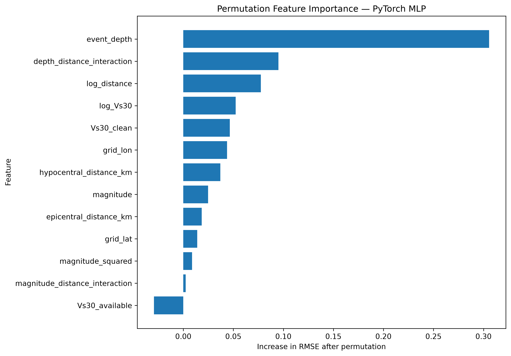
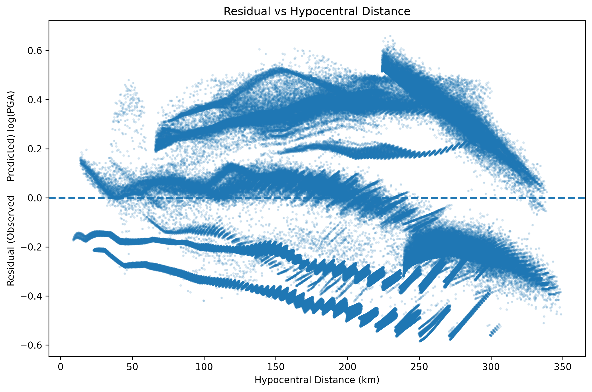
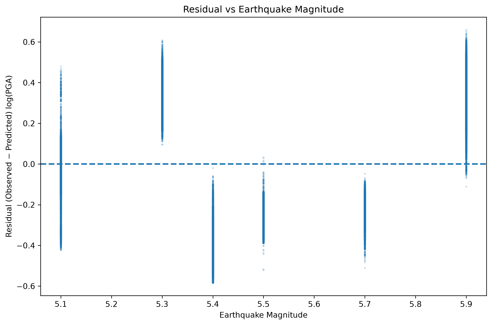
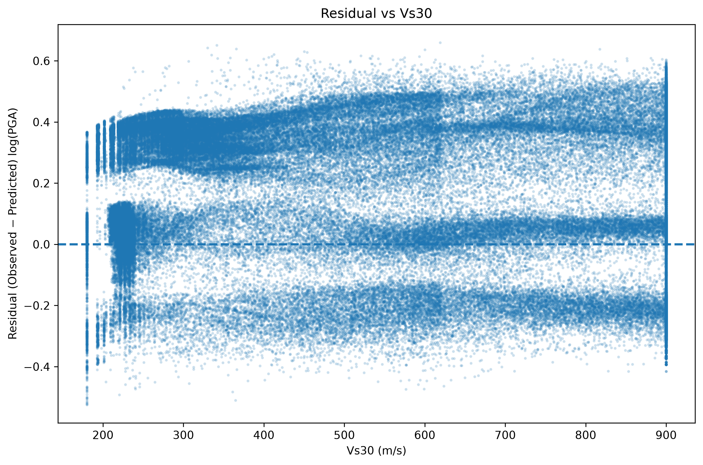
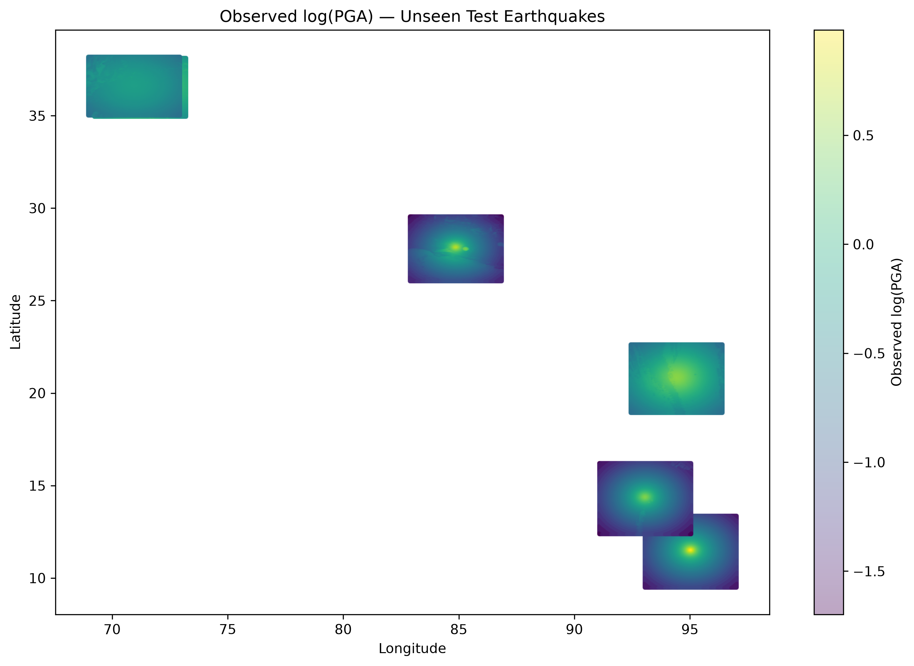
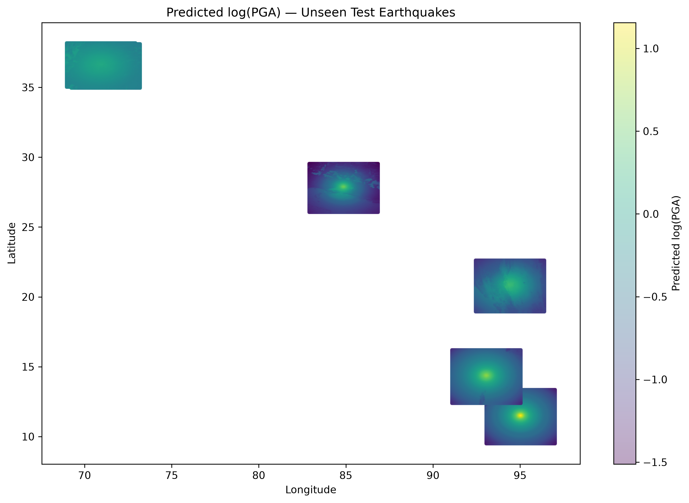

# 🌎 Earthquake Ground-Motion Prediction

### Machine Learning + Deep Learning for Earthquake Ground-Motion Estimation

> A large-scale scientific machine-learning system for predicting logarithmic Peak Ground Acceleration (log-PGA) using earthquake source parameters, propagation geometry, geographic information, and Vs30 site conditions.

[](https://www.python.org/)
[](https://pytorch.org/)
[](https://scikit-learn.org/)
[](https://lightgbm.readthedocs.io/)
[](https://streamlit.io/)
[]()

---

## 🚀 Live Demo

### 🌐 Interactive Streamlit Application

**Earthquake AI — Ground-Motion Prediction**

The deployed application provides:

- Earthquake-level performance exploration
- Model comparison
- Interpretability analysis
- Interactive PGA prediction
- Spatial ground-motion visualization
- Residual analysis

**Live App:**  
PASTE YOUR STREAMLIT APP URL HERE

**GitHub Repository:**  
github.com/UtkarshRode/earthquake-ground-motion-ml

---

# 📌 Project Overview

This project develops an end-to-end machine-learning system for estimating **Peak Ground Acceleration (PGA)** from earthquake and site characteristics.

The prediction target is:

```text
log-PGA = log10(PGA)
```

The project combines:

- ~2.87 million ground-motion observations
- 40 earthquake events
- ShakeMap ground-motion data
- Earthquake metadata
- Vs30 site-condition information
- Physical feature engineering
- Classical machine-learning baselines
- PyTorch deep learning
- Earthquake-grouped cross-validation
- Completely unseen-earthquake testing
- Residual analysis
- Spatial analysis
- Permutation feature importance
- Model-response analysis
- Interactive Streamlit deployment

The central goal is not simply to maximize R².

The project focuses on **credible generalization to earthquakes that were not observed during model development**.

---

# 🎯 Problem Statement

Peak Ground Acceleration is an important ground-motion parameter used in earthquake engineering and seismic hazard analysis.

The problem addressed here is:

> Given earthquake source parameters, propagation geometry, geographic location, and site-condition information, how accurately can machine-learning models estimate observed ground motion?

The model predicts:

```text
log10(PGA)
```

and the deployed application converts the prediction back to PGA:

```text
PGA = 10 ^ predicted_log_PGA
```

This project is intended for **research, educational, and portfolio purposes**.

It is **not** an earthquake early-warning system or structural-safety system.

---

# 📊 Dataset

| Quantity | Value |
|---|---:|
| Total observations | ~2.87 million |
| Earthquake events | 40 |
| Training earthquakes | 28 |
| Validation earthquakes | 6 |
| Final unseen test earthquakes | 6 |
| Final MLP features | 13 |

The dataset integrates:

- Earthquake event metadata
- ShakeMap ground-motion observations
- Geographic grid information
- Propagation distances
- Event depth
- Vs30 site conditions

---

# 🔬 Why Earthquake-Level Validation?

A conventional random row-wise train/test split would be misleading for this problem.

A single earthquake can generate tens of thousands of spatial observations.

Those observations share:

- Magnitude
- Depth
- Source characteristics
- Propagation structure
- Spatial patterns
- Site-response patterns

Therefore, randomly placing observations from the same earthquake into both training and validation sets can cause **event-level information leakage**.

Instead, this project keeps entire earthquakes together.

```text
                     40 Earthquakes
                           │
              ┌────────────┴────────────┐
              │                         │
       Development Events          Final Test
              │                    6 unseen events
       ┌──────┴──────┐
       │             │
   28 Training    6 Validation
    Events          Events
```

Grouped 5-fold cross-validation is performed at the **earthquake-event level**.

The final test contains six earthquakes that were completely excluded from model development.

This provides a substantially more realistic evaluation of generalization.

---

# 🧠 Feature Engineering

The final PyTorch MLP uses 13 engineered features.

```text
1.  magnitude
2.  event_depth
3.  epicentral_distance_km
4.  hypocentral_distance_km
5.  log_distance
6.  magnitude_squared
7.  magnitude_distance_interaction
8.  depth_distance_interaction
9.  Vs30_clean
10. log_Vs30
11. Vs30_available
12. grid_lat
13. grid_lon
```

### Physical motivation

| Feature | Motivation |
|---|---|
| Magnitude | Earthquake source strength |
| Event depth | Source geometry |
| Epicentral distance | Propagation effects |
| Hypocentral distance | 3D source-to-site geometry |
| Log distance | Attenuation representation |
| Magnitude² | Nonlinear source scaling |
| Magnitude × distance | Source-propagation interaction |
| Depth × distance | Coupled source geometry |
| Vs30 | Near-surface site condition |
| log(Vs30) | Transformed site-response representation |
| Vs30 availability | Missing-site-information indicator |
| Latitude / longitude | Geographic and spatial information |

The features are standardized using the fitted training scaler and missing values are handled using the fitted training imputer.

---

# 🤖 Models Compared

The project evaluates multiple machine-learning approaches.

## 1. Elastic Net

Regularized linear regression baseline.

Provides an interpretable reference model.

## 2. Physical Elastic Net

Elastic Net using the physically engineered feature representation.

## 3. LightGBM

Gradient-boosted decision-tree model used to test nonlinear tree-based learning.

## 4. PyTorch MLP

The final deep-learning model.

Architecture:

```text
13 Input Features
       │
       ▼
Linear(64)
       │
     ReLU
       │
BatchNorm(64)
       │
     ReLU
       │
Linear(32)
       │
     ReLU
       │
BatchNorm(32)
       │
     ReLU
       │
Linear(16)
       │
     ReLU
       │
Linear(1)
       │
       ▼
   log-PGA
```

---

# 🏆 Model Performance

## Grouped 5-Fold Cross-Validation

Entire earthquake events are kept together during validation.

| Model | RMSE | MAE | R² |
|---|---:|---:|---:|
| 🥇 **PyTorch MLP** | **0.2128** | **0.1777** | **0.8015** |
| Elastic Net | 0.2474 | 0.2080 | 0.7317 |
| Physical Elastic Net | 0.2999 | 0.2353 | 0.6021 |
| LightGBM | 0.3169 | 0.2385 | 0.5579 |

### Best development model

```text
PyTorch MLP

RMSE = 0.2128
MAE  = 0.1777
R²   = 0.8015
```

---

# 🌎 Completely Unseen-Earthquake Test

The final six earthquakes were never used during model development.

Performance:

| Metric | Unseen-Test Result |
|---|---:|
| RMSE | **0.3113** |
| MAE | **0.2800** |
| R² | **0.6099** |

The difference between grouped CV and unseen-event performance is intentionally reported.

```text
Grouped CV R²       = 0.8015
Unseen-Test R²      = 0.6099
```

This demonstrates an important scientific point:

> Generalization to completely new earthquake events is substantially harder than interpolation within the development distribution.

The project does not hide this performance gap.

---

# 🔍 Interpretability

Model interpretability is performed using **permutation feature importance**.

The strongest contributors include:

1. Event depth
2. Depth-distance interaction
3. Log distance
4. Log Vs30
5. Vs30
6. Geographic coordinates
7. Hypocentral distance
8. Magnitude

These features correspond to meaningful earthquake-source, propagation, site-condition, and spatial effects.

### Important interpretation

Permutation importance measures predictive contribution.

It does **not** establish causality.

---

# 📈 Model Response Analysis

The application provides response curves for:

- Event depth
- Hypocentral distance
- Magnitude
- Vs30

These curves allow inspection of how the trained neural network responds when individual physical variables are changed.

They are intended as:

> Model-behavior diagnostics rather than causal relationships.

---

# 🌍 Unseen-Earthquake Explorer

The Streamlit application allows individual unseen earthquakes to be investigated.

For each event, the dashboard provides:

- Observation count
- RMSE
- MAE
- R²
- Observed mean
- Predicted mean
- Mean residual
- Prediction-level records
- Observed ground-motion map
- Predicted ground-motion map
- Residual map
- Observed-vs-predicted comparison

This makes the final evaluation more transparent than reporting only a single test-set metric.

---

# 🎯 Interactive PGA Prediction

The deployed application includes an inference interface.

Users provide:

```text
Magnitude
Depth
Epicentral Distance
Hypocentral Distance
Vs30
Latitude
Longitude
```

The application then:

```text
User Input
    │
    ▼
Feature Engineering
    │
    ▼
Saved Imputer
    │
    ▼
Saved StandardScaler
    │
    ▼
PyTorch MLP
    │
    ▼
Predicted log-PGA
    │
    ▼
10 ^ log-PGA
    │
    ▼
Predicted PGA
```

The deployed model does **not retrain**.

It loads the saved:

```text
models/pga_mlp_development.pt
models/pga_scaler.pkl
models/pga_imputer.pkl
```

and reproduces the same 13-feature inference pipeline used during model development.

---

# 🧪 Example Prediction

Example input:

```text
Magnitude:              5.5
Depth:                  20 km
Epicentral distance:    100 km
Hypocentral distance:   105 km
Vs30:                   500 m/s
Latitude:               20°
Longitude:              78°
```

Example model output:

```text
Predicted log-PGA ≈ -0.0918
Predicted PGA     ≈ 0.8094
```

The exact prediction should be interpreted within the model's training distribution.

---

# 🖥️ Streamlit Dashboard

The application contains five major sections.

### 🏠 Overview

Project objective, dataset scale, validation strategy, and headline results.

### 🌎 Earthquake Explorer

Interactive analysis of completely unseen earthquake events.

### 📊 Model Comparison

Comparison of classical ML models and the PyTorch MLP.

### 🔎 Interpretability

Permutation feature importance and model-response diagnostics.

### 🎯 PGA Prediction

Interactive inference using earthquake and site parameters.

---

# 📸 Project Visuals

## Model Interpretability



## Observed vs Predicted Ground Motion


## Residual vs Distance



## Residual vs Magnitude



## Residual vs Vs30



## Spatial Observed Ground Motion



## Spatial Predicted Ground Motion



## Spatial Residual Map


---

# 🏗️ Project Architecture

```text
                         ┌─────────────────────┐
                         │  Earthquake Metadata │
                         └──────────┬──────────┘
                                    │
                         ┌──────────▼──────────┐
                         │      ShakeMaps      │
                         └──────────┬──────────┘
                                    │
                         ┌──────────▼──────────┐
                         │  Vs30 Site Data     │
                         └──────────┬──────────┘
                                    │
                                    ▼
                         ┌─────────────────────┐
                         │ Data Cleaning / QC  │
                         └──────────┬──────────┘
                                    │
                                    ▼
                         ┌─────────────────────┐
                         │ Physical Analysis   │
                         └──────────┬──────────┘
                                    │
                                    ▼
                         ┌─────────────────────┐
                         │ Feature Engineering │
                         └──────────┬──────────┘
                                    │
                   ┌────────────────┴────────────────┐
                   │                                 │
                   ▼                                 ▼
          ┌──────────────────┐              ┌──────────────────┐
          │ Classical ML     │              │   PyTorch MLP    │
          │                  │              │                  │
          │ Elastic Net      │              │ Deep Learning    │
          │ Physical EN      │              │                  │
          │ LightGBM         │              │                  │
          └────────┬─────────┘              └────────┬─────────┘
                   │                                 │
                   └────────────────┬────────────────┘
                                    ▼
                         ┌─────────────────────┐
                         │ Earthquake-Grouped  │
                         │ Cross-Validation    │
                         └──────────┬──────────┘
                                    │
                                    ▼
                         ┌─────────────────────┐
                         │ Unseen Event Test   │
                         └──────────┬──────────┘
                                    │
                ┌───────────────────┼───────────────────┐
                ▼                   ▼                   ▼
           Evaluation        Residual Analysis    Interpretability
                │                   │                   │
                └───────────────────┼───────────────────┘
                                    ▼
                         ┌─────────────────────┐
                         │ Streamlit Dashboard │
                         └─────────────────────┘
```

---

# 📁 Repository Structure

```text
EARTHQUAKE_ML_DL/
│
├── app/
│   ├── app.py
│   └── utils.py
│
├── data/
│   ├── raw/
│   ├── interim/
│   └── processed/
│
├── docs/
│   ├── ARCHITECTURE.md
│   ├── DEPLOYMENT.md
│   └── INTERVIEW_GUIDE.md
│
├── figures/
│   ├── mlp_permutation_feature_importance.png
│   ├── observed_vs_predicted_log_pga.png
│   ├── residual_vs_depth.png
│   ├── residual_vs_distance.png
│   ├── residual_vs_magnitude.png
│   ├── residual_vs_vs30.png
│   ├── spatial_observed_log_pga.png
│   ├── spatial_predicted_log_pga.png
│   └── spatial_residual_map.png
│
├── models/
│   ├── pga_mlp_development.pt
│   ├── pga_scaler.pkl
│   └── pga_imputer.pkl
│
├── notebooks/
│   ├── 01_data_acquisition.ipynb
│   ├── 02_shakemap_processing.ipynb
│   ├── 03_eda_and_physical_analysis.ipynb
│   ├── 04_geological_feature_engineering.ipynb
│   ├── 05_feature_engineering_and_dataset_design.ipynb
│   ├── 06_ml_baselines.ipynb
│   └── 07_modeling_evaluation_and_interpretability.ipynb
│
├── reports/
│
├── scripts/
│   └── validate_project.py
│
├── src/
│   ├── __init__.py
│   ├── evaluation.py
│   ├── features.py
│   └── models.py
│
├── MODEL_CARD.md
├── README.md
├── requirements.txt
└── .gitignore
```

---

# ⚙️ Installation

Clone the repository:

```bash
git clone https://github.com/UtkarshRode/earthquake-ground-motion-ml.git
cd earthquake-ground-motion-ml
```

Create a virtual environment:

```bash
python -m venv .venv
```

### Windows

```bash
.venv\Scripts\activate
```

### Linux / macOS

```bash
source .venv/bin/activate
```

Install dependencies:

```bash
pip install -r requirements.txt
```

Run the application:

```bash
streamlit run app/app.py
```

---

# 🔁 Reproducibility

The project separates:

- Raw data
- Intermediate data
- Processed datasets
- Trained model artifacts
- Notebooks
- Application code
- Figures
- Reports

The deployed inference application does not retrain the model.

Instead, it loads the saved model, scaler, and imputer and reproduces the feature-engineering pipeline used during development.

---

# 🧪 Validation Philosophy

A major focus of this project is avoiding misleading evaluation.

The project explicitly distinguishes between:

### Interpolation

Performance on earthquakes similar to those seen during development.

### Generalization

Performance on completely unseen earthquake events.

This distinction is critical for spatially dense scientific datasets where millions of observations may originate from only a relatively small number of physical events.

---

# ⚠️ Limitations

This is a research/portfolio implementation rather than an operational seismic-hazard product.

Important limitations include:

- Only 40 earthquake events are represented.
- Geographic coverage is finite.
- Site-condition coverage is incomplete.
- Unseen-event performance is lower than grouped development performance.
- Residual behavior varies across earthquakes.
- Model behavior outside the training distribution is uncertain.
- Response curves represent learned model behavior, not causality.
- PGA predictions should not be used for structural-safety decisions.

These limitations are explicitly reported because reliable scientific ML requires understanding where a model may fail.

---

# 💡 Key Takeaways

### 1. Deep learning improved grouped validation performance

The PyTorch MLP achieved:

```text
R²   = 0.8015
RMSE = 0.2128
MAE  = 0.1777
```

### 2. Unseen-event evaluation is substantially harder

On six completely unseen earthquakes:

```text
R²   = 0.6099
RMSE = 0.3113
MAE  = 0.2800
```

### 3. Physical feature engineering matters

Distance, depth, magnitude interactions, and Vs30-related features provide physically meaningful information.

### 4. Evaluation is more important than a single score

The project combines:

```text
Large-scale data
      +
Domain knowledge
      +
Physical feature engineering
      +
Classical ML
      +
Deep learning
      +
Earthquake-grouped CV
      +
Unseen-event testing
      +
Residual analysis
      +
Spatial analysis
      +
Interpretability
      +
Interactive deployment
```

---

# 🛠️ Technologies

### Programming

- Python
- SQL-oriented data processing

### Data Science

- NumPy
- Pandas
- SciPy
- Scikit-learn

### Machine Learning

- Elastic Net
- LightGBM
- Feature engineering
- Cross-validation
- Model evaluation

### Deep Learning

- PyTorch
- Multilayer Perceptron
- Batch Normalization
- Model checkpointing

### Visualization

- Matplotlib
- Plotly
- Streamlit

### Deployment

- Streamlit Community Cloud
- Git
- GitHub

---

# 📚 Documentation

Additional documentation is available in:

```text
docs/
├── ARCHITECTURE.md
├── DEPLOYMENT.md
└── INTERVIEW_GUIDE.md
```

The repository also includes:

```text
MODEL_CARD.md
```

which documents the intended use, limitations, evaluation, and model characteristics.

---

# 👨‍💻 Author

**Utkarsh Rode**

IIT Kharagpur

Interested in:

- Machine Learning
- Deep Learning
- Data Science
- Scientific Machine Learning
- Geophysics
- Earthquake Engineering
- Applied AI

---

# ⚠️ Disclaimer

This project is intended for **research, educational, and portfolio purposes**.

The application provides machine-learning estimates of ground motion based on the earthquake events and feature distributions represented in the development data.

It is **not**:

- an earthquake early-warning system
- a seismic alert system
- a structural-safety assessment tool
- an engineering design substitute
- a replacement for professional seismic hazard analysis

Predictions outside the model's training distribution may be unreliable.

---

## ⭐ If you found this project interesting

Feel free to explore the notebooks, model artifacts, evaluation reports, and deployed Streamlit application.

The main objective of this project is not simply to train a neural network, but to demonstrate an end-to-end approach to **credible, interpretable, and deployable scientific machine learning**.